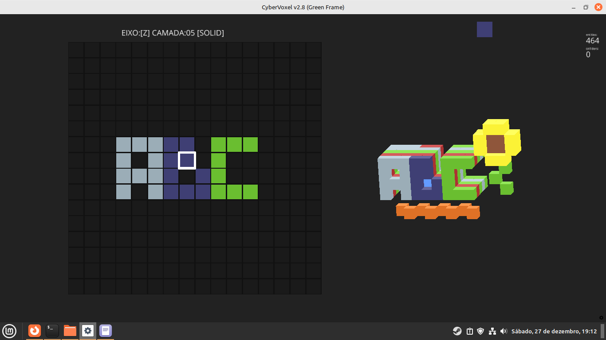

# 🧊 CyberVoxel


**CyberVoxel** is a keyboard-centric, distraction-free Voxel Editor designed specifically for **Cyberdecks** and low-resolution displays (480x320 optimized).

Unlike traditional 3D software that relies heavily on mouse interaction, CyberVoxel uses a **"Slice & Layer" workflow**, allowing you to model complex 3D assets using only a keyboard. It exports directly to **.OBJ** for use in Game Development (Godot/Unity) or 3D Printing.



---

## ✨ Features

* **Cyberdeck Optimized:** UI scales perfectly on small screens (Raspberry Pi compatible).
* **Dual View System:**
    * **2D Slice Editor:** Precise pixel-art style editing.
    * **3D Preview:** Real-time isometric render with dynamic shadows.
* **Pro Workflow Tools:**
    * **Mirror Mode (M):** Real-time horizontal symmetry.
    * **Undo System (Ctrl+Z):** Never lose progress.
    * **Smart Selection:** Neon green high-visibility cursor.
    * **Layer Ops:** Copy/Paste entire slices instantly.
* **Export Pipeline:** Saves editable projects (`.json`) and exports optimized 3D models (`.obj` + `.mtl`) automatically.
* **Palette:** Integrated DB32 retro color palette.

---

## 🚀 Installation

Requires Python 3.8+ and the Ursina Engine.

1.  **Install dependencies:**
    ```bash
    pip install ursina
    ```

2.  **Run the editor:**
    ```bash
    python CyberVoxel.py
    ```

*(Note for Raspberry Pi users: Ensure your OpenGL drivers are active via `sudo raspi-config` > Advanced Options > GL Driver).*

---

## 🎹 Controls & Shortcuts

Designed for speed and keyboard-only usage.

| Context | Key | Action |
| :--- | :---: | :--- |
| **Files** | `Ctrl` + `S` | **Save Project** (+ Auto Export OBJ) |
| | `Ctrl` + `O` | **Open Project** |
| | `R` | Load Reference Images (PNG) |
| **Tools** | `Space` | Paint Voxel |
| | `E` | Erase Voxel |
| | `G` | Flood Fill (Bucket) |
| | `I` | Eyedropper (Pick Color) |
| | `M` | **Toggle Mirror / Symmetry** |
| | `C` | Open Color Palette |
| **Edit** | `Ctrl` + `Z` | **Undo** (Desfazer) |
| | `Ctrl` + `C` | Copy Current Slice |
| | `Ctrl` + `V` | Paste to Current Slice |
| | `Ctrl` + `Arrows` | **Shift Entire Model** (Move world) |
| **Navigation** | `Arrows` | Move Cursor |
| | `.` and `,` | Up / Down Layer (Slice) |
| | `X`, `Y`, `Z` | Change Cutting Axis |
| | `Shift` + `Arrows` | Rotate 3D Preview |
| | `Tab` | Toggle Ghost Mode (X-Ray) |

---

## 🛠️ Tech Stack

* **Language:** Python 3
* **Engine:** Ursina Engine (Panda3D based)
* **Output:** JSON (Data), OBJ/MTL (3D Model)

---

Made for the Cyberdeck community by **Macamandi**.
